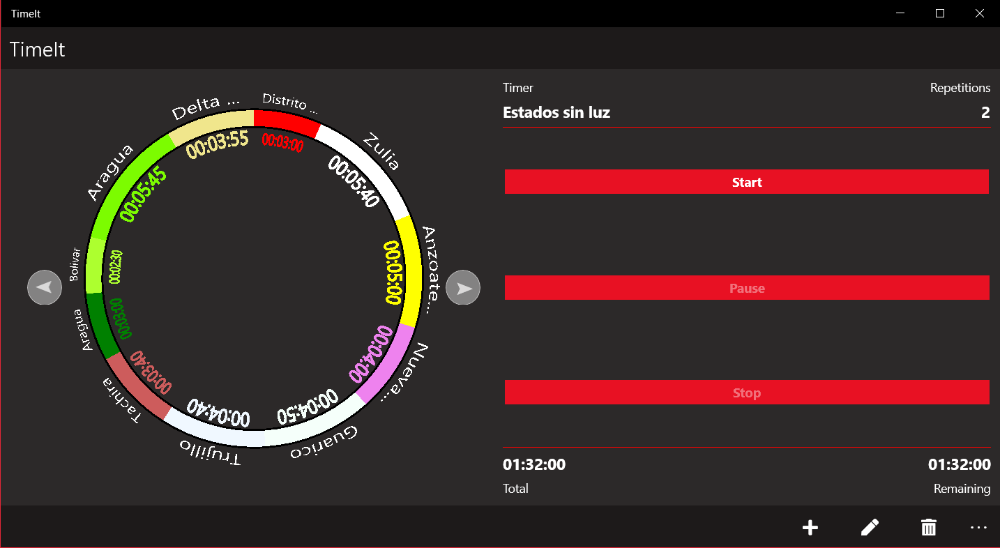
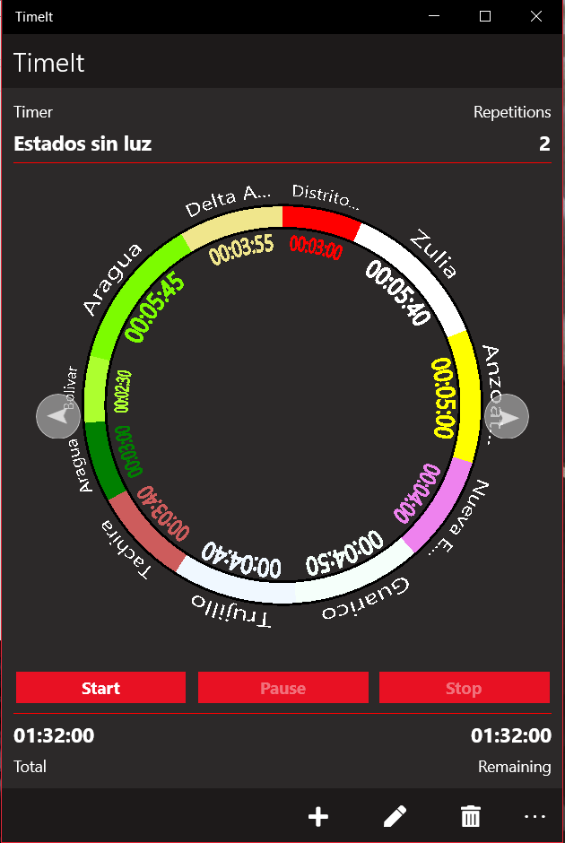
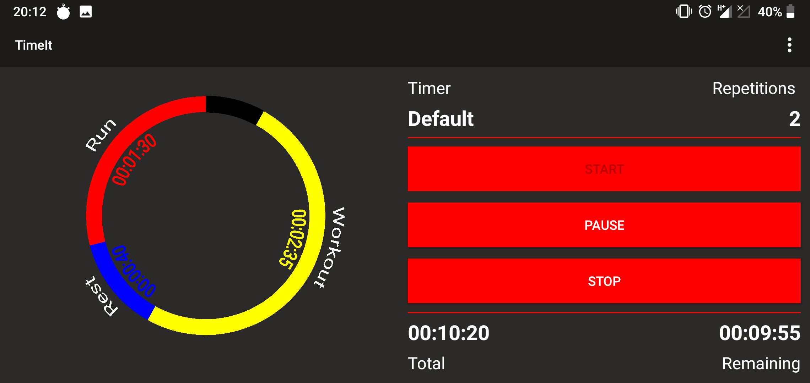
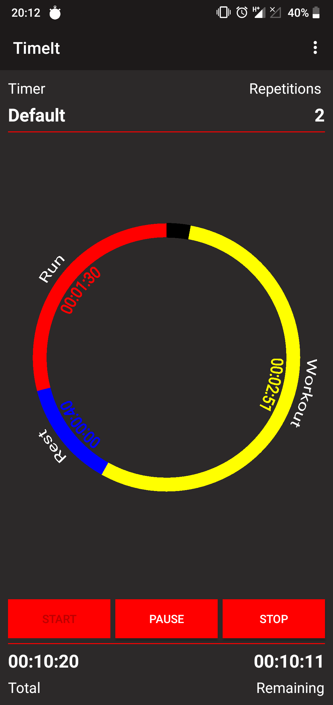

# TimeIt
> A simple timer app made with Xamarin.Forms :)

Create multiple timers with n intervals and get notifications for each one and more.

## Images

### UWP
Landscape             |  Portrait
:-------------------------:|:-------------------------:
  |  

### Android
Landscape             |  Portrait
:-------------------------:|:-------------------------:
  |  

## Instalation

### UWP
I currently don't have a developer account to publish this app in the Microsoft Store (WIP).... so to install this app:
* Go into the Windows Settings -> Updates & Security ->For Developers
* Select the **Sideload apps** checkbox
* Download the latest version of the app in the [Release section](https://github.com/Wolfteam/TimeIt/releases) 
* Decompress the zip file into any folder
* Right-click on the **Add-AppDevPackage.ps1** file. Choose **Run with PowerShell** and follow the prompts. You will be prompted to install my developer certificate and app

* When the app package has been installed, the PowerShell window displays this message: **Your app was successfully installed**. After that just click the Start button to search for the app, and then launch it. 

### Android
Just download and install the apk file (Remember to enable ``Unknown Sources``)
